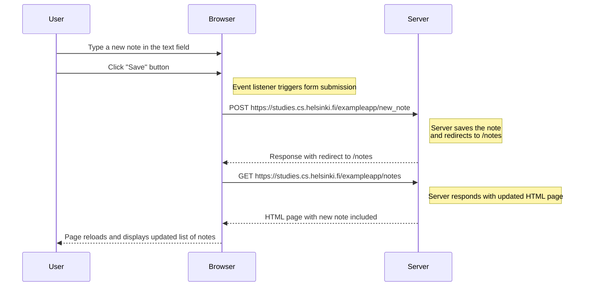

```mermaid
sequenceDiagram
    participant User
    participant Browser
    participant Server

    User->>Browser: Type a new note in the text field
    User->>Browser: Click "Save" button
    note right of Browser: Event listener triggers form submission

    Browser->>Server: POST https://studies.cs.helsinki.fi/exampleapp/new_note
    note right of Server: Server saves the note<br>and redirects to /notes

    Server-->>Browser: Response with redirect to /notes
    Browser->>Server: GET https://studies.cs.helsinki.fi/exampleapp/notes
    note right of Server: Server responds with updated HTML page

    Server-->>Browser: HTML page with new note included
    Browser-->>User: Page reloads and displays updated list of notes
```