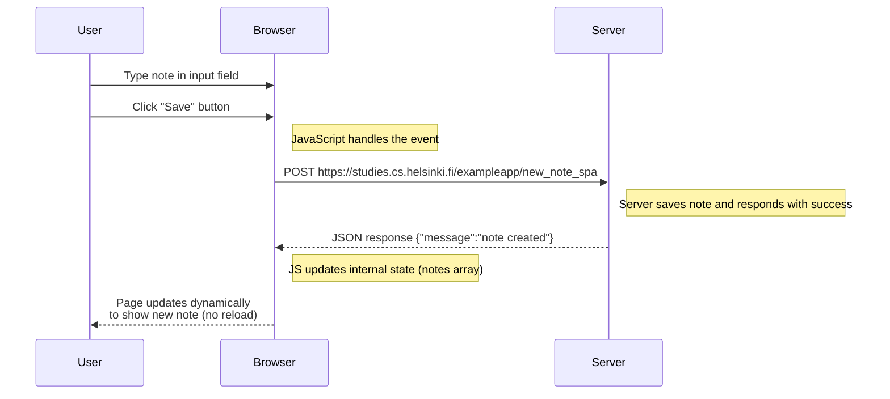

```mermaid
sequenceDiagram
    participant User
    participant Browser
    participant Server

    User->>Browser: Type note in input field
    User->>Browser: Click "Save" button
    note right of Browser: JavaScript handles the event

    Browser->>Server: POST https://studies.cs.helsinki.fi/exampleapp/new_note_spa
    note right of Server: Server saves note and responds with success

    Server-->>Browser: JSON response {"message":"note created"}
    note right of Browser: JS updates internal state (notes array)

    Browser-->>User: Page updates dynamically<br>to show new note (no reload)
```